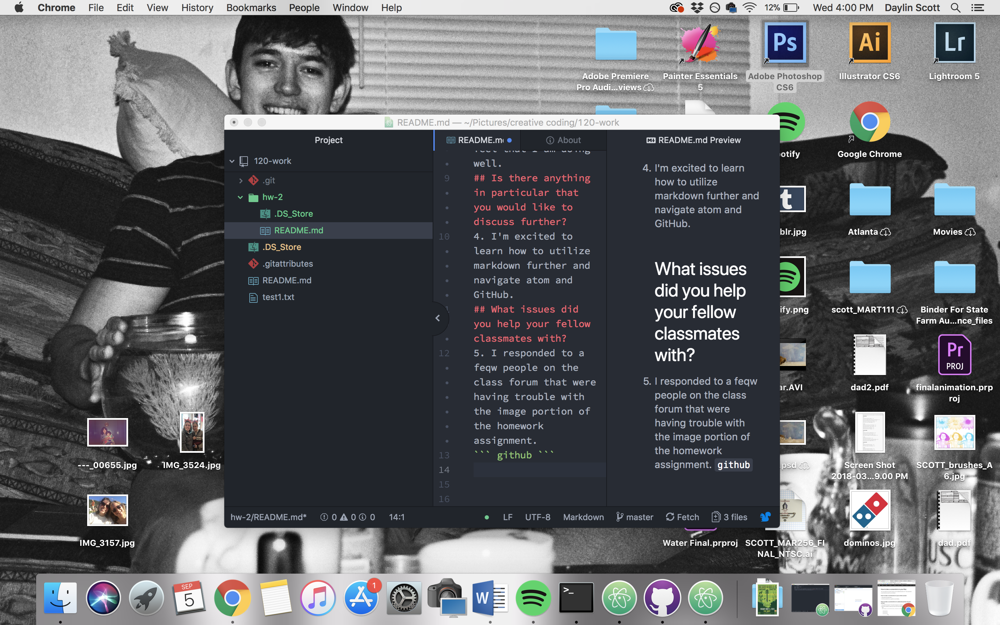

Daylin Scott
# Week 2 Response
## Summarize the work that you did in this homework cycle
1. In this homework cycle I learned how to navigate between Atom, GitHub, and GitHub desktop. I am also beginning to learn the basis of markdown. I also found [https://github.com/adam-p/markdown-here/wiki/Markdown-Cheatsheet#lists] to be very helpful.
## What steps did you take to complete the assignment?
2. This is my second time taking this class, and having at least some sort of basis of knowledge was very helpful. I followed along with all of the instructions and tutorials to make sure I had a solid understanding of everything, even if I was fairly certain that I could remember it.
## Did you have any problems or issues?
3. Honestly, this week was fairly straightforward. I became a little overwhelmed, simply because of the ammmount of work and reading, but overall I didn't really have any problems, and I feel that I am doing well.
## Is there anything in particular that you would like to discuss further?
4. I'm excited to learn how to utilize markdown further and navigate atom and GitHub.
## What issues did you help your fellow classmates with?
5. I responded to a feqw people on the class forum that were having trouble with the image portion of the homework assignment.
``` github ```

